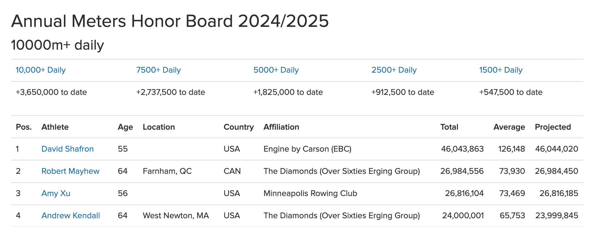
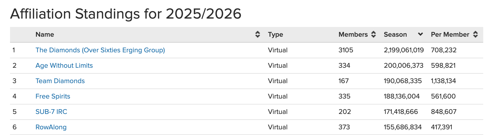

# Annual Meters

Annual (or more strictly, [seasonal](../training/terminology.md)) metres are tracked by Concept2. This appeals to many of our members whose preferece is for regular, gentle-paced, long rows, and we often see them popping up at the top of the honorboard.

However, this is a whole team effort and a challenge that we win by a very wide margin each year. At the time of writing (January 2026) we have accumulated almost 11 times the metres of the team in 2nd place.

So our competition is ... our younger selves! Each year we aim to surpass the total we achieved the previous year, and i doing so, set a new World Record. If we're successful, we make available to all members who contributed to the total, a personalised certificate confirming and celebrating their participation.
