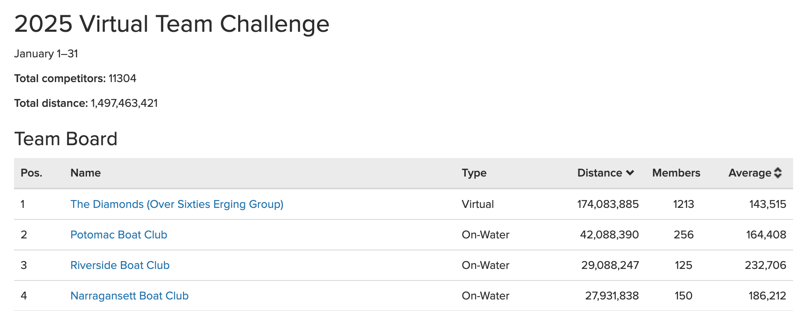
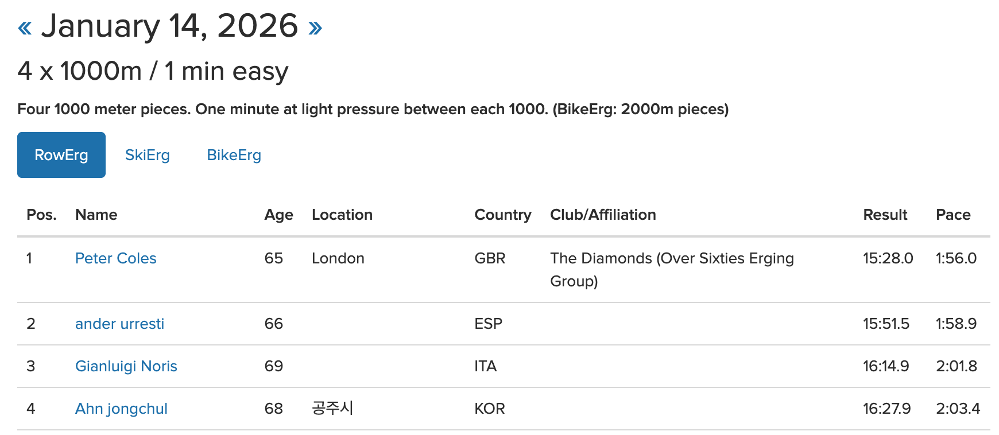

# Concept 2 Challenges

Concept2 offer a wide range of challenges each year. Some celebrate a single day, others several days, or even a whole month. Details of current and future challenges may be found on the challenges tab in [your Concept2 logbook](https://log.concept2.com/challenges).

Participate and log metres during each challenge and Concept2 will make generate a certificate confirming your achievement, which many Diamonds collect proudly.

## Team Challenges

Twice a year there are team challenges. On ein January and the other from mid-September to mid-October. We'll announce these through our weekly email and Faceboohk group as they approach.

Even if you are affiliated to the Diamonds, and therefore part of our team, you may need to join the team in your logbook to particpate in these team challenges (yes we know that's confusing but it's outside our control).

We have many members who find these challenges align nicely with their desire for consistent, long, gentle rows, and so consistently win the challenges by some way.

## Annual Metres

In addition to the shorter challenges, Concept2 tracks the total metres each season for each affiliation (team). This is especially interesting to us, not just because we win it every season by a wide margin, but also because we aim each year to improve on our previous total and thus set a new world record. We have [a separate page about this](annual-meters.md).

## Workout of the Day (WOD)

In addition to the scheduled challenges, Concept2 offer a [workout of the day](https://www.concept2.co.uk/training/wod), every day, to be done on the RowErg, SkiErg or BikeErg. These are short, varied and fun workouts, usually taking less than 30 minutes, and designed to work for a wide range of ability and experience.

Like each of the challenges described earlier, each WOD comes with a honorboard (shown below) that can be filtered to match your performance to those in the same age, weight category and gender.

You can sign up to their email list to have the daily challenge sent to your mailbox each morning.
